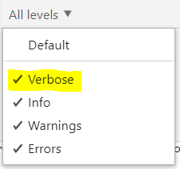
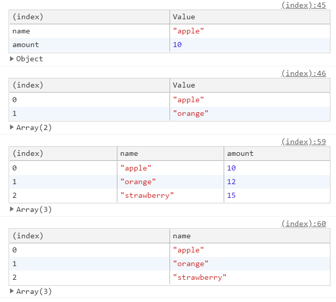

# `console.log()`, 진짜 그것만으로 충분할까?
아주 오래전 웹 개발에서 *Chrome Insepctor* 같은 강력한 도구가 없던 시절 자바스크립트 디버깅엔 `console.log`가 필수였다.
그 때의 습관 탓일까, 디버깅 하면서 간단한 값 확인은 중단점을 걸고 스텝을 넘겨가며 로직을 확인하기보다 로그를 찍어 확인하는 것이 훨씬 빠르게 느껴져서 여전히 많이 사용하고 있다.

`console.log()`는 사실 유용하다. C나 JAVA와 같은 컴파일 언어는 로그를 찍는 코드가 추가되면 컴파일을 필수적으로 해야하는 시간이 걸리지만, javascript같은 인터프리터 언어는 굳이 신경쓸 필요가 없기 때문이다. (*Typescript* 같은 전처리가 들어간다면 좀 다른 얘기가 되어버리지만..)
여하튼 `console.log()`는 굉장히 유용하고 자주 쓰이게 된다.

하지만 `console.log()`만 있는 것이 아니다.
디버깅에 유용한, 당신의 디버깅을 다채롭게 할 몇가지 console API를 소개한다.

## `console.debug()`
```
  const greeting = 'hello world';
  console.debug(greeting);
```
`console.log`와 거의 차이가 없는 `console.log`의 alias라고 보면 될 것 같다.

하지만 다른 점이 있다. *Chrome Insepctor* 상의 *level*이 **Default levels**로 설정되어있을 경우에 `console.debug`에 의한 로그는 나타나지 않는다. `Verbose`를 체크해주어야 `console.debug`의 로그가 나타난다.



이는 아래에서 소개하는 다양한 기능이 없는 심플한 `console.log` 같은 로그이면서도 `console.log`와 기능적으로 분리하여 사용할 수 있게 만든다.

## `console.error()`
굉장히 많이 사용하는 기능이다. 원하는 *에러 메시지*를 콘솔에 찍을 수 있다.

```
  const error = new Error('you are not loggined');
  console.error(error);
```

그 결과는 굉장히 에러스러운 메시지를 출력하게 만든다.


`console.log`나 `console.debug`와의 큰 차이점은 이미지의 **▼**에서 보면 알 수 있듯이 stack trace가 가능하다. 어느 지점에서 해당 로그가 나왔는지 확인 가능하므로 어떤 경로로 에러가 나왔는지 추적하기가 굉장히 수월하다.

## `console.warn()`
`console.error`와 유사하지만 warning(경고)를 위해 사용한다.
`console.error`에 비해 많이 사용되지는 않지만, 라이브러리나 프레임워크와 같이 여러 사람들과 협업하는 과정에서 무언가를 알려야할 때에 꽤 유용하게 사용할 수 있다. 예를들면 다음 버전에서 deprecate 될 것이라든지, 동작은 하지만 올바른 사용방법이 따로 있다든지.


`console.warn`도 trace를 확인할 수 있다.

## `console.assert()`
`console.assert`도 꽤 유용하게 사용할 수 있는 메소드다..

```
  const undef = undefined;
  const emptyStr = '';
  const greeting = 'Hello World';
  console.assert(undef);
  console.assert(emptyStr);
  console.assert(greeting);
```
`undefined`나 `''` 같은 `falsy` 값에 대한 error 로그를 나타난다. 아닌 경우에는 로그가 나타나지 않는다.


## `console.time()` & `console.timeLog()` & `console.timeEnd()`
벤치 마킹 등 코드 실행을 측정할 때 사용할 수 있는 API이다.
```
  console.time('timer #1');
  let count = 0;
  const timerId = setInterval(() => {
    console.timeLog('timer #1');
    count++;
    if(count > 2) {
      clearInterval(timerId);
      console.timeEnd('timer #1');
    }
  },1000);
```


위와 같이 사용해서 타임스탬프를 확인할 수 있다.
파라미터로 `label`을 받는다.

참고로 [`console.timeStamp()`][ref-timestamp]는 표준이 아니라고 함.

## `console.trace()`
`console.trace()`는 `console.log()`와 유사하지만 콜스택 정보를 함께 콘솔에 나타낸다.

```
  console.trace('hello world');
```


## `console.group()` & `console.groupEnd()`
`console.group()`과 `console.groupEnd()`는 로그를 그룹해서 몪어준다. 콘솔창을 정리할 때 유용하다.

```
  console.group();
  console.log('hello');
  console.log('world');
  console.groupEnd();
```


## `console.table()`
`console.table()`은 표 형태로 로그를 나타낸다.
`Object`형태로 파라미터를 넘길 수도 있고, `Array`나 `Object[]`형태도 가능하다. `Object[]` 형태로 파라미터를 넘겼을 경우는 두 번째 파라미터에 프로퍼티명을 파라미터로 넣어서 원하는 속성만을 확인할 수도 있다.
```
  console.table({name: 'apple', amount: 10});
  console.table(['apple', 'orange']);
  const fruits = [
    {
      name: 'apple',
      amount: 10,
    }, {
      name: 'orange',
      amount: 12,
    }, {
      name: 'strawberry',
      amount: 15,
    }
  ];
  console.table(fruits);
  console.table(fruits, ['name']);
```


`console.debug()`에서 부터 `console.tabel()`까지 다양한 Console API를 확인해보았다.
다양한 Console API를 이용해서 좀 더 세련되고 풍성한 디버깅을 즐겨보자!

### Reference
1. [MDN][ref-mdn]
2. [There's more than just console.log()....other useful ways to use the console in javascript][ref-dev-to]

[ref-timestamp]: [https://developer.mozilla.org/en-US/docs/Web/API/Console/timeStamp]
[ref-mdn]: [https://developer.mozilla.org/en-US/docs/Web/API/Console]
[ref-dev-to]: [https://dev.to/developer_buddy/there-s-more-than-just-console-log-other-useful-ways-to-use-the-console-in-javascript-17l8]