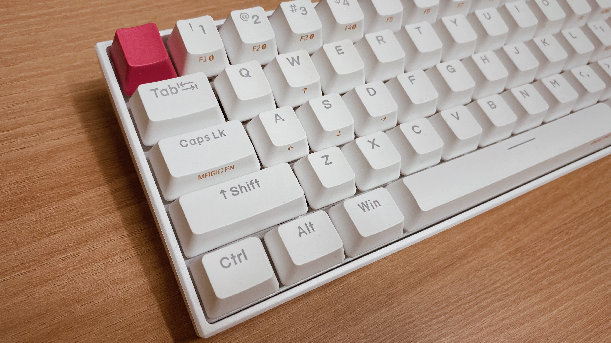
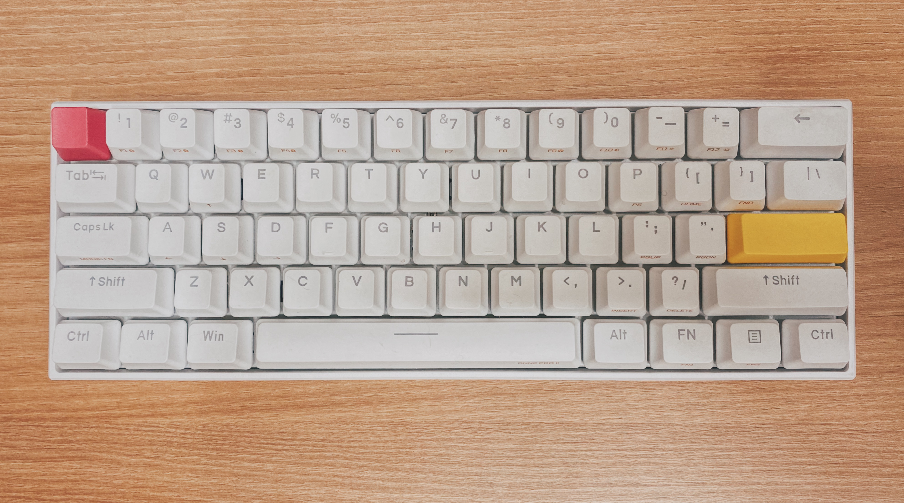
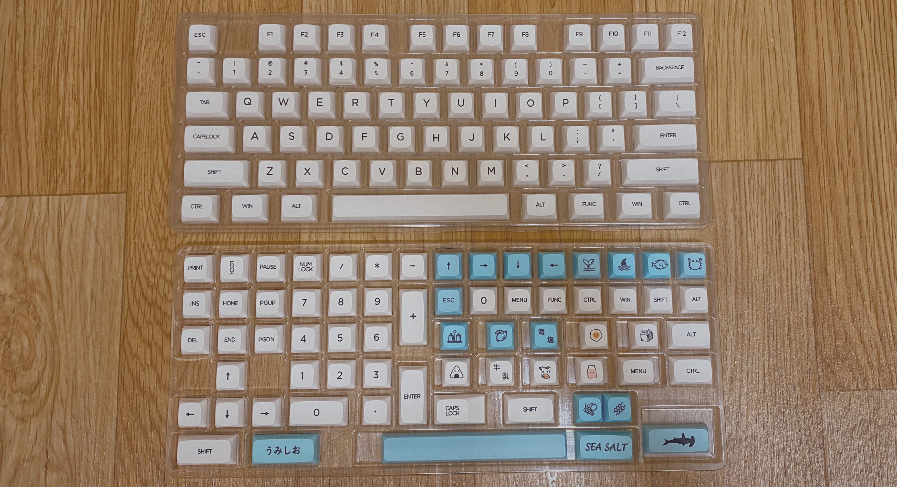
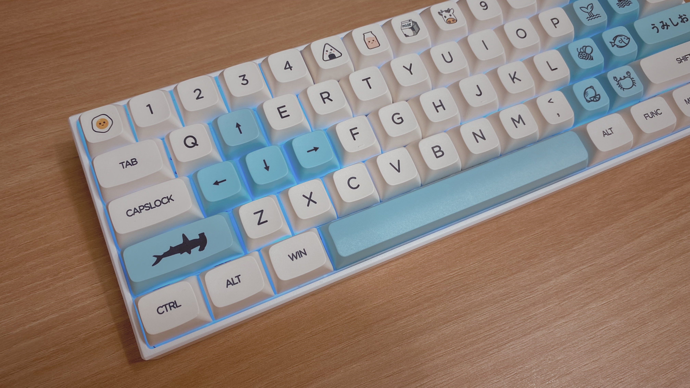
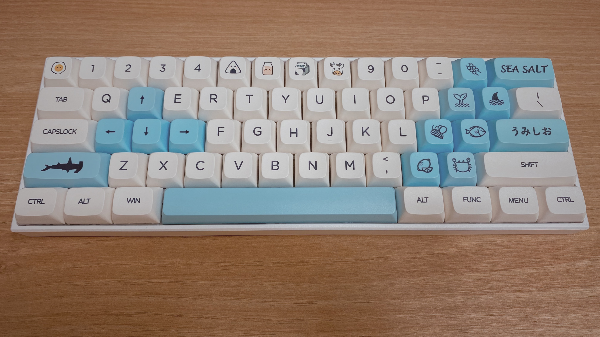
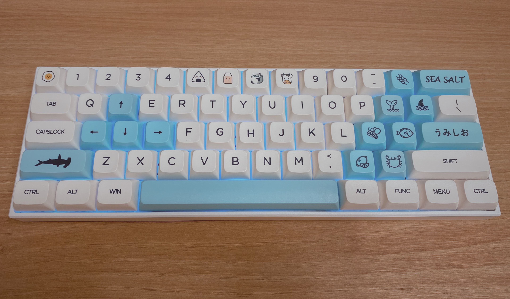

저렴하고 예쁜 키보드를 찾는 사람들이라면 한 번쯤 들어봤을 키보드 앤프로2. 키보드를 좋아하는 사람이라면 한 번쯤 살펴봤을만큼 유명한 키보드인데, 그도 그럴 것이 조금 써 보면 세심한 디테일에서 그 만듬새가 그냥 단순한 고민으로 만든 것이 아님을 짐작하게 한다.

일반적인 사용자들에게 익숙하지 않은 포커 배열임에도 앤프로를 결정하는 큰 이유는 **디자인**일거다. 앙증맞은 사이즈에 깔끔한 디자인과 마감, 시선을 압도하는 화려한 백라이트 LED, 게다가 패키지로 제공하는 포인트 키캡으로 따로 키캡을 구입하지 않아도 나만의 키보드를 꾸밀수 있다.

이대로도 좋았다. 충분히 아름답고 좋았지만, 새로운 키캡을 찾아 떠났다.

새로운 키캡을 찾아 떠나게 된 데에는 나름의 계기가 있었는데,

1. XDA 키캡

    낮고 동글동글한 XDA키캡이 내 디자인 취향도 맞았지만 사용하기에도 더 편리했다. 의외일 수 있겠지만, 노트북 키보드에 익숙하고, 오히려 팬터그래프나 버터플라이 키보드가 익숙하고 취향이다보니 적응이 어렵다기보다 오히려 더 잘 맞는 건 내게 자연스러운 일이었다. 개인적으로는 체리 프로파일이 좀 부담스러웠다 ㅋㅋ.그리고 동글납작한 생김새가 더욱 깜찍하게 만들어주는 건 덤.

2. 알리익스프레스 섬머 세일

    알리에서 섬머 세일을 진행해서 비교적 저렴하게 살 수 있어서 이번 기회에 구입하게 됐다. 이 키캡은 의외로 자주 세일을 진행해서 저렴하게 구입할 수있는 기회가 많다고 한다. 

결정한 키캡은 Honey and Milk 키캡으로, [알리](https://ko.aliexpress.com/item/32893869108.html?spm=a2g0s.9042311.0.0.2c174c4dLaw6Pu)에서 쉽게 구할 수 있다.

# 키캡 구성

140개로 구성되어 있어서 텐키가 있는 키보드 등 대부분의 배열에서도 사용할 수 있는 장점이 있다. 포인트 키캡들도 넉넉하게 제공하기 때문에 취향에 따라 키보드를 자유롭게 꾸밀 수 있다. 다른 키캡들과 조금 다른 특이한 점이라면, 알트, 컨트롤 등 보조 키들이 일반 로마자나 숫자 키캡처럼 흰색이라는 점? 보통 두개가 색깔이 달라 포인트를 주던데, 오히려 이점 깔끔해 좋아서 고르게 되었다.

# 키캡 장착

이리저리 끼워보다가 결정했다. 우유같으면서도 여름 계절과 잘 맞는 시원한 느낌이 드는 키캡인 것 같다.

# 키캡 교체 후기

## 좋은 완성도와 디자인

사실 키캡을 찾으면서가인이 조금 유치해 보인다든지, 색감이 어딘가 좋지 않는다든지.. 조금 엉성해보이는 이유로 꺼려지거나하는 부분들이 있었는데, 이정도 가격에 굉장히 마감도 괜찮고, 디자인도 좋은 키캡인 것 같다. 같은 제조사인 것 같은데, 허니 컨셉 키캡도 후기가 좋은 것을 보았는데, 역시 이 키캡도 괜찮았다. 색상도 너무 마음에 들고. 흰색도 그냥 흰색이 아니라 약간 아이보리빛이 도는 것이 마치 연유를 연상케하는 디자인이다. 동글동글한 키캡 모양과도 굉장히 잘 어울리는 모양새이다.

## XDA 프로파일 적응도

XDA 프로파일 키캡에 따라다니는 수식어 같은 것이 키캡 높이가 일정해서 오타라든지, 적응에 대한 부분이다. 하지만 노트북 키보드 수준의 납작한 키보드에도 적응되어 있는 사람이라면 별 문제 없이 적응하게 되는 것 같아서 엄청 걱정할 부분은 아닌 것 같다. 높이가 높은 프로파일은 나는 적응이 안될 것 같다ㅋㅋ. 심지어 동글납작하고 앙증맞은 키캡을 보고 있으면  만족도는 상승.

## 타건 소음

체리보다 XDA 프로파일이 약간 낮기 때문에 타건 소음이 줄어든다는 말이 있어서 조금 기대하던 부분이 있었다. 앤프로2 게이트론 적축을 사용중인데, 적축인데도 소음이 상당해서 사용에 너무 신경에 거슬렸다. XDA 키캡으로 갈게되면서 확실히 조금 줄어든 것 같은 느낌이지만, 만족스럽게 줄어든 느낌은 아니다. 그래서 유의미한 차이가 있다고 말할 수는 없을듯.

# 결론

결론은 굉장히 만족!