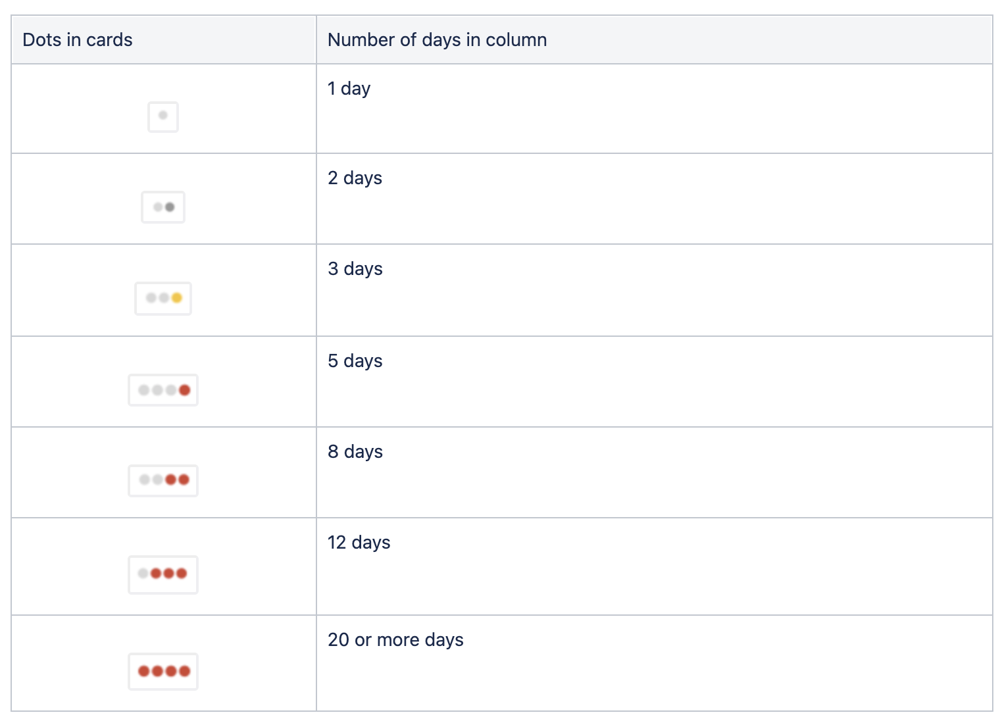

# JIRA 칸반 보드에 점들은 대체 무엇일까?

스크럼이나 칸반은 이미 업계 표준이 될 정도로 많이 사용되고 있는 방법론인 것 같다. JIRA 역시 마찬가지로 굉장히 많이 쓰는 툴인 것 같다. 요즘은 취준 전에 JIRA 사용 경험을 이미 하고 오는 사람들도 있을 정도다.

내가 있는 조직도 기본적으로는 스크럼으로 개발을 하고 있기 때문에 평소에는 스크럼 보드를 이용하고 있는데, 최근 일정 조정이 되면서 칸반 보드를 생성해서 사용하게 됐다. 그런데, 사용하고 있던 카드 레이아웃과 다른 생소한 요소를 발견하게 되었다.

이 점은 뭐지?

동글동글 귀여운 것 같은데... 다른 카드를 살펴보면 다른 점도 확인할 수 있다.

저건 뭐지? 뭔가 빨간 색 점이 위험 신호를 알리는 것만 같은 느낌은 확실하다. 😑;;

이 점들의 의미는 마우슬 호버해보면 쉽게 알 수 있었다.

**이 열에서 6일**... 그렇다. 이 티켓이 이 열에 들어선지 시간을 카운트해주고 있었다. 점이 많고 빨갈수록 그 상태로 오래 있었다는 의미, 즉 고여있는 티켓이고 체크가 필요한 티켓이라는 의미가 된다. 아이콘을 통해 직관적으로 확인할 수 있어 좋은 것 같다.

숫자로 표시되지않고 색깔과 모양의 시각 정보만으로 나타내기 때문에 한눈에 들어오는 반면, 규칙이 복잡해서 직관적인 이해를 방해한다는 [의견](https://uxdesign.cc/a-deep-dive-into-those-dots-on-jira-kanban-cards-45ed61f22421)도 있는 것 같지만, 확실히 한 눈에 파악하기에는 용이한 것 같다.

점을 나타내는 규칙은 [공식 문서](https://support.atlassian.com/jira-software-cloud/docs/customize-cards/)에 설명이 있어 찾아볼 수 있다:

## Reference

[https://support.atlassian.com/jira-software-cloud/docs/customize-cards/](https://support.atlassian.com/jira-software-cloud/docs/customize-cards/)