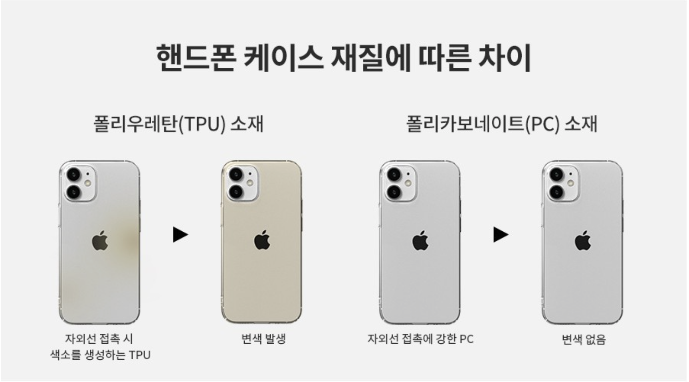
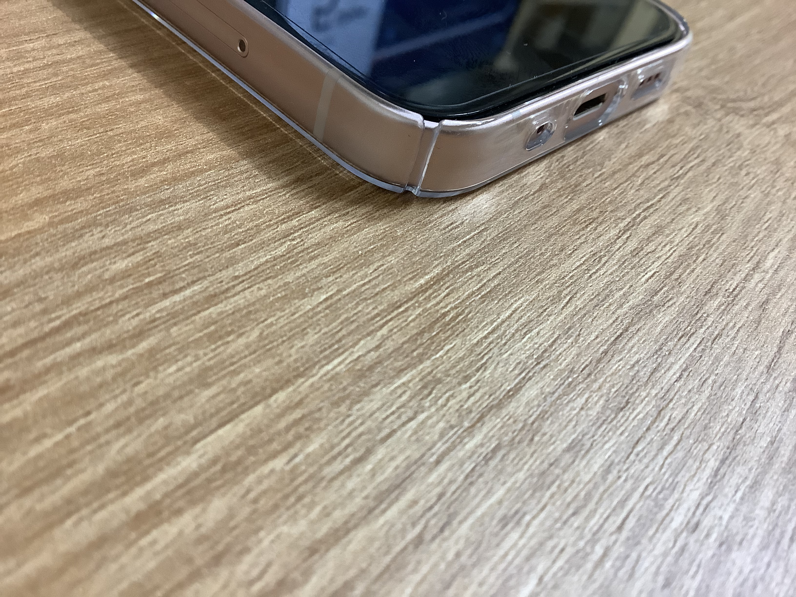

# 아이폰13 미니 신지모루 에어로핏 구입 후기

신지모루 에어로핏 구매를 망설이는 분들께 조금이라도 정보가 되길 바라며 이 글을 작성합니다.

## 아이폰13 미니 사전주문 GET!

10월 1일 대란이었던 아이폰13 미니 사전주문을 성공했다. 쿠팡은 시잔주문 개시 시각이었던 10월 1일 0시 0분까지도 카드 즉시할인 혜택 등을 공개하지 않았다. 결론적으로 11번가가 좀 더 저렴하게 받을 수 있었지만, 주문의 편의성으로 쿠팡을 대기타고 있었는데, 광클로 성공적으로 사전주문을 할 수 있었다. 😆

## 신지모루 에어로핏을 구입하다.

사전주문 다음 단계는 즐거운 마음으로 케이스와 액정필름을 구입하는 것이었다. 내손을 떠날 때까지 아주 깔끔하게 쓰고 싶다는 욕심히 강해서 -최근에는 리퍼를 받지 않고도 기스 하나 없이 사용했다- 깔끔한 사용을 도와줄 케이스와 액정필름은 필수였다. 개인적으로는 다른 케이스보다 실리콘처럼 말랑한 재질의 케이스가 데미지도 적고 사용하기 좋아서 그런 케이스를 찾아봤다.

설레는 기분으로 검색을 했지만, 이제막 출시해서인지 선택지가 그렇게 많지 않았다. 어떤 것을 사면 좋을까 고민을 하다가 **신지모루**라는 브랜드가 눈에 보였다. 검색을 해보니 나름 추천하는 사람들도 있어서 별 생각없이 구매를 결정했다. 일단 검색결과에 잘 걸렸기도 했지만, 들어가서 봤을 때, **스토어에서 전면 액정필름뿐만 아니라 후면 카메라 필름도 판매도 함께 하고있었기 때문에** 배송비를 아낄 겸 주문한 것이었다. 배송은 빠르게 왔고, 그상태로 그냥 아이폰만 기다리고 있었다.

## 드디어 부착.

10월 8일. 약속의 때가 왔고 아이폰13 미니가 영롱한 자태로 내게 왔다. 🥺 드디어 구매해뒀던 신지모루 케이스를 뜯었다. 앗 근데... 내가 생각한 느낌이 아니었다.

다시봐도 아름다운 아이폰의 자태 🥺

지금보니 굉장히 매끄러워 보이는 것 같고, 스피커 등 구멍들도 딱 잘 맞다.

# 신지모루 에어로핏. 그냥 사용하기에는 심상치 않은 점 몇 가지

## 신지모루 에어로핏 케이스는 **하드 케이스**다.

우선 **PC 소재**라는 것. PC 소재가 무엇인지 정확하게 모르고 상품 소개 페이지에 있는 아래 이미지를 보고 그냥 아 변색이 없는 좋은 소재구나. 라고만 생각했다.

하지만 **주의할 점은  PC 소재는 하드 케이스 소재**란 것이었다. 변색보다는 소재 자체가 딱딱하다는 말이다.

나는 중간에 **케이스를 뒤트는 영상덕에 소재가 말랑한 것인줄만 알았던 것(...) PC소재가 하드케이스를 의미한다는 것**을 이 글을 쓰는 순간에야 깨달았던 것이다.

이런 하드케이스가 나같은 사람에게 굉장히 거슬리는 가장 큰 이유는 **탈착 시 기스가 생길 수 있다**는 점이다. 하드케이스는 소재가 단단하기 때문에 강하게 눌러 끼워 넣는 방식인데, 꼭 **옆면을 긁는 듯한 느낌**을 받게 된다. 현재는 조금 나아진 것 같지만, 아이폰 4~5시절 다이아몬드 커팅의 옆면은 손톱에도 코팅이 벗겨져서 바로 데미지가 생길 정도로 예민한 것이어서, 이런형태의 탈착 방식은 정말 치명적으로 불안감을 준다. 😥 **물론 끼우고 나서 봤을 때에는 데미지가 없어보였다.** 하지만 여러번 꼈다 뺐다 하면서 테스트해볼 수는 없었다. 너무 불안해서 🥲....

새 것이니까 당장은 마감이 매끈해서 괜찮았겠지만, 만약 쓰다가 마감이 조금이라도 거칠어진 상태에서 탈착을 한다고 생각하면 😱....

## 계속 신경쓰이는 빈틈...

탈착만이 신경쓰이는 것이 아니다. 빈틈... 케이스 아래쪽에 이유 모를 절개가 있다. 이 절개는 아마도 하드케이스다 보니까 조금의 탄력을 주기 위한 부분이 아닐까 하고 생각되는 부분이다. 하지만, [케이스와 폰 사이에 존재하는 먼지 등은 사용하면서 안에서 흔들리면서 잔기스를 만들어 낸다.](https://macguyver.kr/924) 그래서 웬만하면 먼지가 들어갈 틈이 없는 것을 선호하는데 떡하니 절개가 있으니..😨 실제로 에어로핏을 부착한 상태로 주머니에 넣고 뺐는데도 절개부위 근처에 먼지가 낀 것을 확인할 수 있었다. 아무래도 신경쓰이는 절개였다.

## 그립감? 너무 매끄러워...

그리고 아주 매끄러운 케이스이다. 얇고 매끄럽게 만들어져서 잡으면 **끼운듯 안끼운 듯**한 느낌에 **본연의 느낌** 그대로 라고 하는데, 나로써는 글쎄.. 결국 꼈기 때문에 사실 겉보기나 느낌은 비슷한 것 같다.. 쌩폰을 만지는 듯한 그립감이라고 하면서 선호하는 사람도 있는 것 같다. 그런데 클리어 하드 케잇의 특징이라고 해야할까? 내겐 **너무 매끈했다**. 이런 느낌을 선호하는 사람도 있겠지만, 나는 너무 불안했다 😨 언젠가 무심코 쥐었을 때 손에서 미끄러져 떨어질 것 만 같은 그런 느낌이 드는 것이다. 심지어 [구매한지 하루만에 떨어졌는데 케이스가 깨져버렸다는 후기](https://m.blog.naver.com/tweec2/222175737983)를 발견할 수도 있었다.

# 결론

신지모루 에어로핏을 우연한 계기로 구입하게 되었는데, 이 케이스의 장점들은 상품 후기나 다른 블로그에서 쉽게 찾을 수 있을 것 같다. 데미지에 예민한 입장에서 신지모루 에어로핏을 착용했을 때 느꼈던 신지모루 단점에 대해서 작성했다. 이 케이스 구입을 망설이고 있는 사람에게 조금이라도 도움이 되길 바란다.😉

이 케이스를 뒤로하고 황급히 바꾼 다른 케이스에 대해서도 추후 리뷰를 남길 수 있길바라며..ㅋㅋ