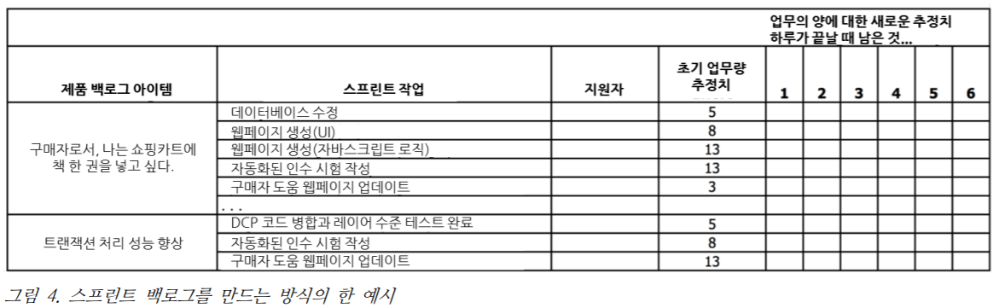

이 글은 [ScrumPrimer][ref] 사이트의 스크럼의 이론과 실천에 대한 가벼운 안내서를 요약한 글입니다. 요즘 여기저기서 *애자일*을 도입한다, *스크럼* 도입한다고만 하면서 여러가지 이유로 실제로 잘 운영되지 못하는 경우가 많은데... 내용을 보니 정말 중요한 이야기들이 많아 공유하려 합니다.

# 개요 Overview

*스크럼*은 *[다기능팀](https://en.wikipedia.org/wiki/Cross-functional_team)*이 제품이나 프로젝트를 **반복적**이고 **점진적**인 방식으로 개발하기 위한 개발 프레임워크

- *스프린트*라고 불리는 주기로 구성
    - 반복 주기는 4주를 넘지 않으며 (보통 2주)
    - 멈추지 않고 하나가 끝나면 다음것이 시작
    - **시간이 고정** (*timeboxed)*되어있음
        - 일이 끝났던, 끝나지 않았던 기간이 **절대 늘어나지 않고 정해진 날짜에 끝**난다.
        - 보통 스크럼 팀은 스프린트의 길이를 정해놓고 개선해서 주기를 더 짧게 할 수 있을
        때 까지는 모든 스프린트를 그 길이로 진행
- 매 스프린트 시작 시 다기능팀(약 7명)은
    - 우선순위가 매겨진 리스트에서 아이템(요구사항)을 고름
    - 스프린트가 끝날 때 어떤 **결과물**을 낼 수 있을지 합의
        - 결과물은 분명하고 정말로 **"완료"**라고 할 수 있는 것을 말함
- 스프린트 동안은 **어떤 새로운 아이템도 추가되지 않음.**
    - *다음 스프린트*에 대한 변화는 수용
    - *현재의 짧은 스프린트*는
        - 작고
        - 분명하며
        - **상대적으로 안정적인 목표에 집중**해야 한다.
- 매일 진척사항에 대해 간단히 점검 + 남은 일을 완료하기 위해 필요한 다음 단계 조정
- 스프린트가 끝날 때
    - 이해관계자와 해당 스프린트에 대해 검토하고 시연함
    - 다음 스프린트에 반영될 수 있는 피드백 수집
- 스크럼에서는 스프린트가 끝날 때 **작동할 수 있는 제품**을 만드는 것이 강조
    - 시스템이 통합되고
    - 완전히 테스트 되었으며
    - 최종 사용자를 위한 문서가 작성되었고
    - 잠재적으로 출시 가능한 제품
- 스크럼의 주요한 주제는 **검토**와 **조정**

# 스크럼에서의 역할들 (Scrum Roles)

**제품 책임자**와 **팀**, **스크럼마스터**가 있음.

## 제품 책임자 (Product Owner)

- 투자 수익률(ROI)를 최대해야할 책임
- *기능(Feature)*를 식별하고
- 이것을 반영해 리스트의 우선순위를 수립하여
- 어떤 것이 리스트의 가장 위에 와야하는지 결정
- 지속적으로 리스트의 우선순위를 재조정 + 개선
- 제품이 상업적인 경우, 제품 책임자는 **제품의 손익에 대한 책임이 있다**
- 고객과 제품책임자가 같을 수도 있음
- Product Manager나 Product Marketing Manager의 역활과 비슷하지만 기존 Product Manager와는 다름
    - 제품 책임자는 프로젝트 관리자에게 개발에 대한 결정권을 위임하는 것이 아님
    - 팀과 적극적인 소통 + 모든 이해관계자들과 협업을 통해 ⇒ 매 스프린트의 결과를 검토하며 우선순위를 정함
- **스크럼의 최종 권한을 가진 책임자는 오직 1명**이며 업무의 가치에 대한 책임이 있음

## 팀

- 개발팀이라고도 함
- 제품 책임자가 지시하는 제품(App, Web, etc.)을 만든다
- **다기능 (cross-functional)** = 필요한 모든 전문 지식을 가지고 있어야 함.
- 높은 수준의 자율성과 책임을 가진 **자기조직(self-organizing, self-managing)**이어야 함.
- 제품 책임자가 제안한 것들 중 한 스프린트 동안
    - 몇 개의 아이템을 완성할 지
    - 목표 달성을 위한 방법을 결정
- 고정된 전문가는 없으며, 매 스프린트가 진행되는 동안 스스로 정한 목표의 달성을 위해 **어떤 방식으로든** 함께 일한다.
- 오직 팀원만 있기 때문에 **다중학습(multi-learning)**이어야 함.
- 팀 구성은 7명~2명 안팎
    - 제품을 개발
    - 제품 책임자에게 어떻게 제품을 훌륭하게 만들 것인지에 대한 아이디어를 제시
- 스프린트 동안 하나의 제품을 위해서 100% 몰두해서 일할 수 있을 때 가장 생산적 & 효율적
⇒ **주의가 분산되거나 흐름이 바뀌면서 낭비되는 것을 막아야 함.
여러 제품이나 프로젝트에 걸쳐져서 동시에 여러 작업을 하게 되는 것을 피해야 함.
팀원이 바뀌는 것을 지양**
- 하나의 팀이 고객 중심의 기능들을 완성하기 위한 모든 일(계획, 분석, 프로그래밍, 테스트)을 종종 하므로 이런 팀은 또한 *기능팀(feature team)*이라고도 불린다

## 스크럼마스터(ScrumMaster)

- 제품 그룹이 사업적인 가치를 만들기 위해서 스크럼을 배우고 적용하는 것을 돕는다.
- 팀과 제품 책임자, 조직이 성공하기 위해 가능한 모든 일을 돕는다.
- 관리자가 아니며, 프로젝트 관리자도 아니고 팀 리더도 아니며 팀 대표자도 아님!
단지 도움을 주는 사람
    - 장애물을 제거
    - 외부의 간섭으로부터 보호
    - 새로운 개발 방식에 적응할 수 있도록 도움
    - 제품 책임자와 팀 그리고 다른 조직원이 스크럼을 능숙하게 사용할 수 있도록 가르치고 지도하고 설명
- 비록 작은 팀의 경우는 팀원이 기존에 하던 일을 줄이고 이 역할을 할 수도 있지만, **그래도 모든 시간 동안 이 일에만 전념하는 스크럼마스터가 있어야 한다**
- 스크럼마스터와 제품 책임자는 **초점이 매우 다르며** 병행할 경우 혼란이나 충돌이 생기기 때문에 **같은 사람이 맡을 수 없다**

> 참고: 스크럼에서는 **프로젝트 관리자의 역할이 전혀 없다.** 왜냐하면 전혀 필요하지 않기 때문이다. 기존의 프로젝트 매니저가 맡았던 일들은 스크럼의 세 가지 역할에 나누어 할당되는데 스크럼 마스터보다는 팀과 제품 책임자에게 대부분 할당한다. 스크럼을 하면서 프로젝트 관리자를 추가한다는 것은 **스크럼을 근본적으로 잘못 이해하고 있다는 것**을 말한다. 그리고 이런 경우 일반적으로 책임들 간의 충돌, 분명하지 않은 권한, 차선의 결과 같은 것들이 발생한다. 때론 프로젝트 관리자가 스크럼마스터의 역할을 하게 될 수 있지만 이런 접근방식이 전적으로 성공할 수 있을지는 개인이 얼마나 두 역할의 근본적인 차이에 대해서 이해를 했는지, 그날그날의 역할과 성공하기 위한 마음가짐을 모두 이해했는지에 달려있다. 스크럼마스터의 역할을 완전히 이해하고 성공하기 위한 핵심 기술들을 개발하기 위한 좋은 방법은 Scrum Alliance의 Certified ScrumMaster 교육을 받는 것이다.

## 기타 역할

- 제품의 성공에 기여하는 다른 이해관계자들
    - 직무 관리자
    - 공학 관리자 등
- 스크럼을 적용할 때에는 변해야 함
    - 그들은 스크럼의 규칙들과 참뜻을 존중함으로써 팀을 지원한다.
    - 그들은 팀과 제품 책임자가 찾은 장애물을 제거하는 것을 돕는다.
    - 그들은 그들의 전문 지식과 경험을 쓸 수 있도록 한다

    **⇒ 업무를 할당하고 현황 보고서를 받고 다른 형태의 세세한 관리 → 멘토링, 코칭, 장애물 제거를 돕기, 문제를 해결하는 것을도와주기, 창의적인 조언 제공, 팀원들의 기술 개발 지도** 로 변화

# 제품 백로그 (Product Backlog)

- 스프린트 시작 전에 제품 백로그가 있어야 함
- 사용자 중심의 기능들을 우선순위를 매겨 리스트화
- 제품 수명기간 동안 계속 존재하고 개선되면서 **해당 제품의 로드맵 역할**을 함
- 우선 순위에 따라 기록된 것이 한눈에 명확히 드러나야 함
- 하나의 제품에 대해 오직 하나의 제품 백로그만 존재: **제품 책임자는 팀을 포함해 이해관계자들의 관심사를 전반적으로 반영하여 우선순위를 결정해야함.**

- 백로그는 아래 내용들을 모두 포함한다.
    - 새로운 기능 (e.g. 모든 사용자는 장바구니에 책을 담을 수 있다)
    - 개발에 대한 발전적인 목표 (e.g. 시스템을 C++ 에서 Java기반으로 변환한다)
    - 팀의 개선 목표 (e.g. 테스트 속도를 향상시킨다)
    - 연구 업무 (e.g. 신용 카드 인증 속도를 향상하기 위한 해결책 조사)
    - 결함 (결함이 많을 경우 별도의 추적 시스템을 사용)
- 아이템은 어떤 방식으로든 분명하고 계속 유지될 수 있도록 표현
    - 대부분의 아이템들은 고객 가치 전달에 초점이 맞추어져 작성
- **DEEP**
    - **Detailed appropriately**
    최우선 순위의 아이템은 낮은 우선순위의 아이템보다 먼저 진행되기 때문에 **상세하고 세밀하게 기술**되어야 함
    - **Estimated**
    팀은 제품 책임자에게 제품 백로그의 각 아이템에 대해 해당하는 **일의 양 (effort)와 기술적인 위험성(technical risk)에 대한 추정치를 제공**해야 함.
    사업적 이해관계자들은 제품 **요구사항의 가치에 대한 정보**(수익, 비용절감, 사업적 리스크, 중요성 등)를 다양한 이해관계자들에게 전달해야 함.
    - **Emergent**
    제품 책임자는 학습 내용, 변동사항에 따라 제품 백로그는 자주 개선해야 함.
    매 스프린트마다 우선순위에 따라 추가/제거/수정 등 변경을 거침
    - **Prioritized**
    제품 백로그의 최우선 순위 아이템부터 1에서 N까지 순서로 우선순위가 매겨져야 함.
    최우선 순위의 아이템들은 **적은 비용으로 큰 가치를 내는 것**이어야함
    *큰 위험을 포함하고 아이템의 우선순위를 높게 잡는 방법(tackle high risks early, before the risks atack you)*도 있음.
- 스크럼마스터는 사업적 가치를 가늠하는 법을 배울 수 있게 도와야 함
- 스크럼에는 매 스프린트마다 일이 얼마나 끝났는지 추적하는 기술이 있음 ⇒ 속도velocity
- 다가오는 스프린트의 제품 백로그 아이템들은 팀이 이 아이템들에 대해서 이해할 수 있을 만큼 **충분히 세분화되어서 스프린트 계획 때 팀이 유의미한 예측**을 할 수 있어야 함 ⇒ **“실행가능한(actionable)” 크기**
- 시간과 비용이 많이 드는 주요한 기술 개선사항은 제품 백로그에 포함돼야함.
    - 가벼운 기술사항에 대해서는 독자적으로 맡아 진행할 수 있더라도, 매 스프린트마다 팀은 대부분 시간을 내부적인 기술 업무 보다는 제품 책임자가 정한 목표를 위해 사용해야함.
- 무엇이 중요한지를 최소한으로 명시해야 함.

# 완료 기준 (Definition of Done)

- 매 스프린트의 산출물 = 잠재적으로 출시 가능한 제품 증분 (Potentionally Shippable Product Increment)
- 제품을 출시하기 위해 필요한 모든 활동 = 잠재적으로 출시 가능이라는 말의 정의에 포함되어야 함 (그러므로 스프린트 동안 끝나야 함)
- 매 스프린트마다 잠재적으로 출시 가능한 제품을 전달하는데 실패할 경우
    - 팀이 자동화가 덜 되었거나
    - 충분히 다기능적이지 않기 때문
- 스프린트 시작 전 제품 책임자와 팀은 완료 기준에 대해 합의를 봐야함.
- 좋은 제품 책임자?
    - 완료기준이 가능하면 잠재적으로 출시할 수 있을 수준
    - 개발이 투명해지고 지연되는 경우가 줄어들며 리스크가 감소

# 스프린트 계획(Sprint Planning)

- 매 스프린트 시작 전 스프린트를 준비하기 위한 회의로, 2개의 파트로 나뉜다.
    - 파트1: **“무엇(what)”**
    - 파트2: **“어떻게(how)”**
- 참가자
    - 파트1: 제품 책임자, 팀, 스크럼마스터
    - 파트2: 팀, 스크럼마스터, 제품 책임자(optional)
- 기간: 각 파트는 스프린트의 한 주당 한 시간 이내로 제한

## 스프린트 계획 파트1

- 제품 책임자와 팀이 제품 백로그 중 제품 책임자가 이번 스프린트에서 진행되길 원하는 우선순위가 높은 아이템들을 검토
- 지난 스프린트에서 제품 백로그 개선을 하는 동안 분석되었으므로 간단히 질문에 대해서 한 번 명확히 하는 작업만 진행
    - 우선순위가 높은 아이템에 대한 목표와 내용에 대해서 정의
    - 제품 책임자의 의도 파악
- 제품 책임자가 무엇을 원하고 그것이 왜 필요한지 초점
- **스프린트 목표**를 정한다.
    - 이상적으로는 짜임새가 있는 주제를 담고 있을 것
- 아이템의 이상적인 규모 = 전체 스프린트에 비해 현저히 작게 쪼개질 것 (스프린트 기간의 1/4 이내에 완수될 수 있을 정도의 크기)

## 스프린트 계획 파트2

- 아이템을 **어떻게 수행**할 지에 대해서 초점
- **팀은 제품 백로그의 우선순위가 높은 것부터 순차적으로 해당 스프린트가 끝날 때까지 할 수
있는 아이템의 수를 예측** ⇒ 핵심!
**스크럼에서는 완수해야 할 작업을 제품 책임자가 팀에 할당하는 것이 아니라, 팀이 스스로 할 수 있는 작업의 양을 결정하는 것을 중요**
- 팀은 우선순위가 아래에 있는 제품에 대해서도 영향력을 행사할 수 있음 (보통 팀과 제품 책임자 둘 다 현재 우선순위가 아래에 있는 아이템이 더 위에 있는 것이 적절하다고 생각하는 경우)
- 스프린트 계획 회의는 2주 단위의 스프린트를 기준으로 4시간을 넘지 않도록 제한
- 수용 능력을 활용하는 방식으로 목표치 결정하기
    - 업무 수행에 얼만큼의 시간을 쓸지 추정
        - 스프린트와 관련된 업무를 수행하는데 쓸 시간 = 회의 참석, 메일, 휴식시간 등은 제외하는 개념
    - 일반적으로 하루 4~6시간 정도 = 스프린트에 대한 수용 능력
    - 수용 능력이 정해지고 나면 기간동안 제품 백로그에 있는 아이템 몇개를 할지, 완수할지 검토
- 아이템 선정
    - 지난 스프린트의 회고 때 나온 개선 목표를 위한 작업
    - 제품 백로그에서 제품 책임자가 가장 우선순위를 높게 설정해놓은 아이템을 골라서 ‘충분’할 때까지 세분화
- 스프린트 동안 해야 하는 일에 대한 리스트 = **스프린트 백로그(Sprint Backlog)**

- 계획회의의 결과 = **스프린트 약속 (Sprint Commitment): 스프린트가 끝날 때 어떤 결과물을 내놓을 것인지에 대한 현실적인 목표**

> 스크럼의 기본적인 하나의 특징은 **팀이 스프린트의 목표를 한 번 설정하면, 모든 추가사항이나 변경사항들은 다음 스프린트까지 미뤄져야 한다는 것**이다. 이 말은 만일 제품 책임자가 스프린트 중에 팀이 했으면 하는 새로운 아이템을 결정해도 **다음 스프린트가 시작할 때 까지는 바꿀 수 없다는 뜻**이다. 만약 외부 상황에 의해서 우선순위가 많이 바뀌거나 이 일을 계속 했을 경우 팀이 시간을
낭비하는 꼴이 된다면 제품 책임자나 팀은 **스프린트를 중단**할 수 있다. 팀이 스프린트를 중단하면 새로운 스프린트 계획 회의를 통해서 새로운 스프린트를 시작한다. 보통 이런 일이 일어나는 것을 막는 것이 좋다. 왜냐하면 이런 경우 제품 책임자와 팀이 사기가 하락해서 극단적인 결정에 의지하도록 하기 때문이다.

- 스프린트 동안 목표가 바뀌지 않는 긍정적인 효과
    - 팀
        - 팀은 목표가 바뀌지 않을 것임을 확실하게 알고 일을 하기 대문에 확실하게 완료하는데 초점을 둘 수 있음
        - 스프린트에 자신이 제품 백로그에 우선순위를 매기고 팀에게 준 아이템들에 대해서 제대로 생각해 보게 됨
    - 제품 책임자
        - 팀이 실질적이고 분명한 일들을 끝내기 위해서 최선을 다 한다는 것을 알게 된 것에 확신
        - 다음 스프린트가 시작하기 전에는 어떤 변경이든 제품 백로그에 반영할 수 있다.

# 데일리 스크럼(Daily Scrum)

- 팀원 사이의 최근 정보 공유와 협력
- 참가자
    - 팀(required)
    - 제품 책임자(optional)
    - 스크럼마스터 (팀에도 이 역할을 할 사람이 있어야함)
- 기간: 최대 15분 이내
- 팀원
    - 각자 한 업무에 대해 서로 맞추고 장애 요소에 대해서 공유
        1. 지난 회의 이후로 무엇을 완료했는가?
        2. 다음 회의 전에 무엇을 완료할 것인가?
        3. 이것을 하는데 장애 요소는 무엇인가?
- 보고 자리가 아닌, 진행사항에 대한 공유/협력의 시간
- 누군가 장애 요소를 말했다면, 스크럼 마스터는 팀원들이 그것을 해결할 수 있도록 도와주는 역할
- 회의가 필요하다면 종료 후 이어서 회의 진행

> 팀이 스크럼을 처음 한다면 일반적으로 **관리자나 또는 권한이 있다고 여겨지는 사람들이 데일리 스크럼에 들어오지 않기를 권장**한다. 이런 위험한 행동을 통해 팀은“ 감시”당하고 있다고 생각하게 되어서 매일 비현실적인 기대치에 대한 주요 진척도를 보고해야 한다는 압박을 느끼게 된다. 또한 팀은 문제점을 보고하는 것에 대해서 억제를 당한다고 느끼며 팀이 스스로 잘 관리하지 못하고 세부사항까지 관리를 받게 된다. 이해관계자들은 팀의 회의에 따라가기 보다는 팀의 진척을 느리게 하는 장애 요소들을 제거해 주는 것이 더 유익할 것이다.

# 스프린트 동안 진척도 추적(Tracking Progress during the Sprint)

- 스크럼에서 팀은 스스로 관리한다.
- 스프린트 백로그에 있는 현재 작업을 완료하기 위해서 얼마나 남았는지 새로 추정
- 스프린트 번다운 차트에 표시
- 지속적으로 효율적으로 일할 방향을 찾아서 조정해야 함

## 제품 백로그 개선(Product Backlog Refinement)

- 미래의 스프린트를 위해 큰 아이템을 쪼개고 아이템을 분석하고 재추정하고 우선순위 재조정
- 참가자
    - 팀
    - 제품 책임자(optional, 세부적 개선에 도움을 줄 수 있는 전문가라면)
    - 요구사항을 이해하고 팀에 도움을 줄 수 있는 사람들 참가.
    - 스크럼마스터(효과적으로 진행할 수 있도록 지도하기 위해서 참가하고 나머지 부분은 참가하지 않을 수도 있음.)
- 기간
    - 일반적으로 팀이 사용 가능한 시간의 10% 넘지 않도록 함
    - 분석이 작업이 많은 아이템이기 때문에 오래 걸릴수는 있음
- 가치있는 스크럼 가이드라인 중 하나는 매 스프린트의 일정 부분은 팀 전체가 미래의 스프린트들을 위해 제품 백로그를 개선해야하는데 써야 한다는 것
    - 세부적인 요구사항 분석
    - 아이템 쪼개기
    - 새로운 아이템에 대한 추정
    - 현재 아이템 재추정
- 이 과정을 통해 스프린트 계획이 상대적으로 간단해짐

# 스프린트 리뷰(Sprint Review)

- 제품 증분의 기능성에 관한 검토와 조정
- 참가자
    - 팀
    - 제품 책임자
    - 스크럼 마스터
    - 제품 책임자가 초대한 적합한 이해관계자들
- 스프린트의 한 주당 한 시간으로 제약 (2주 길이 스프린트 = 최대 2시간)
- 스프린트를 검토
    - 데모 x, 중요한 개념은 *검토*와 *조정*
    - 제품 책임자: 제품과 팀에 대한 상황을 배움
    - 팀: 제품 책임자와 시장에 대해 배움
- 실제 제품으로 데모를 할 것
- 리뷰 준비에 30분 이상을 사용하지 않을 것 (그렇다면 뭔가 잘못된 것)

# 스프린트 회고(Sprint Retrospective)

- 프로세스와 환경에 관련된 것을 검토하고 조정하는 활동
- 참가자
    - 팀
    - 스크럼 마스터
    - 제품 책임자 (optional)
    - 팀이 초대하지 않은 이해관계자들은 **참석 불가**
- 스프린트 한 주당 45분으로 제한
- *프로세스*와 *환경*에 대해서 검토하고 조정
- 스크럼 마스터는 회고에서 퍼실리테이터 역할을 할 수도 있으나, 외부 퍼실리테이터를 찾는 것이 더 나을 수 있음
- 기법은 [Agile Rerospectives(Derby, Larsen 2006)](https://agile.2ia.net/Agile%20Retrospectives.pdf) 참고
- 긍정적인 부분 부정적인 부분 모두 집중할 것

# 다음 스프린트의 시작(Starting the next Sprint)

- 새로운 시각으로 새로운 아이템을 추가, 기존 아이템 제거 등 수정하여 제품 백로그 업데이트
- 애자일 개발의 한 가지 원칙은 “지속 가능한 속도”이며 탐은 합리적인 수준으로 적절히 일해야 이 주기를 계속 이어나갈 수 있다.

> 생산성은 팀의 실천방식이 발전하고 **팀의 생산성에 방해가 되는
요소들을 제거해 가며 계속해서 오르는 것**이지, 잔업이나 품질에 대해서 타협하며 오르는 것이 아니다.

- 스프린트는 제품 책임자가 제품을 출시할 준비가 되었다고 판단할 때까지 계속
- 완벽한 스크럼에서 제품은 매 스프린트가 끝날 때 마다 잠재적으로 출시가 가능한 상태
- 하지만 많은 조직들은 개발 방법, 툴, 인프라가 약하고 이런 완벽한 스크럼은 할 수 없으며 그렇기 때문에 남은 일을 처리하기 위해서 **“릴리즈 스프린트(Release Sprint)”**가 필요

# 릴리즈 관리(Managing Release)

- 반복적인 모델의 경우 장기적인 출시 계획을 어떻게 해야 하는가?
1. 첫번째 릴리즈를 위한 새로운 제품
2. 추후의 릴리즈를 위한 현재의 제품
- 새로운 제품의 경우나 현재의 제품에 단지 스크럼만 적용하는 경우
    - 첫 번째 스프린트 전에 제품 백로그 개선을 시작 = **제품 백로그 제작 or 릴리즈 계획**
    - 모든 아이템에 대한 추정도 필요
- 확실히 정해진 제품 백로그가 있는 제품의 경우는 다음 릴리즈를 위한 어떤 특별하거나 큰 릴리즈 계획이 필요 없음 (= 매 스프린트마다 5~10% 정도의 시간을 백로그 개선, 추후를 위한 준비에 사용)
- 스크럼은 매 스프린트마다 잠재적으로 출시 가능한 코드를 만드는 것을 강조하기 때문에 제품 책임자는 중간 릴리즈를 하기로 할 수도 있고, 고객이 완료된 작업에 대한 수혜를 더 빨리 받을 수 있게 할 수도 있다.
- 계획을 세우고 개선하는 것을 통해서 릴리즈에 대한 큰 방향성을 제시하고 어떻게 결정들의 균형을 맞출지(예를 들면 범위냐 일정이냐 같은)를 명확히 하는 것이 핵심

# 애플리케이션 또는 제품에서의 관점

- 스크럼은 더 이상 시작, 중간, 끝이 있는 프로젝트는 없다.
- 기존의 프로젝트 관리자도 없다.
- 필요한 모든 프로젝트 관리 업무는 팀과 제품 책임자가 한다.
    - 제품 책임자는 내부적인 사업 고객이거나 제품 관리와 관련된 사람

> 때로는 앞의 방법으로도 해결하기 힘들 정도로 새로운 일이 적어서 팀이 한 스프린트 내에 여러 애플리케이션의 아이템들을 담당할 수도 있다. 그러나 이런 방법은 **다양한 애플리케이션에 걸쳐서 비생산적인 멀티태스크를 만들 수도 있으니 주의**해야 한다. 스크럼에서 생산성에 대한 기본적인 **한 가지는 팀은 한 스프린트에 한 개의 제품이나 애플리케이션에 집중해야 한다**는 것이다.

# 공통 과제(Common Challenge)

> 도전적인 스크럼 실천 방법을 할 때의 한 가지 **흔한 실수는 스크럼을 변형시키는 것**이다. 예를 들어 산출물을 만드는데 문제가 있는 팀은 스프린트의 기간을 늘일 수도 있고 그래서 절대 시간이 다 되지 않을 것이다. 그리고 그런 프로세스에서는 추정하고 시간을 관리하는 것을 어떻게 하면 더 잘할지 절대 배울 필요가 없을 것이다. 이런 식으로 경험이 있는 스크럼마스터의 코칭이나 지원 없이 조직은 그들의 약점과 장애와는 반대로 스크럼을 변형시킬 수도 있고 스크럼이 주는 진정한 혜택을 약하게 만들 수도 있다. 여기서 말하는 스크럼이 주는 진정한 혜택은 **장점과 단점을 눈에 보이도록 하고 조직이 더 높은 수준으로 나아가기 위한 선택 사항을 제시하는 것**을 뜻한다.
다른 흔한 실수는 스크럼이 **특정 실천 사항을 분명하게 요구하지 않는다**는 이유로 어떤 실천 사항을 피하거나 금지해야 한다고 생각하는 것이다. 예를 들면, 스크럼에서는 제품 책임자가 제품을 위한 장기적인 전략을 세우는 것을 요구하지 않는다. 또한 스크럼에서는 엔지니어가 복잡한 기술적인 문제에 대해서 더 경험이 많은 엔지니어에게 조언을 구하는 것을 요구하지도 않는다. 스크럼에서는 이런 부분들은 개인이 올바른 결정을 하도록 남겨둔다. 대부분의 경우는 위의 두 실천 사항은 하는 것이 더 낫다.

### Reference
1. [Scrum Primer][ref]

[ref]: https://scrumprimer.org/translations
