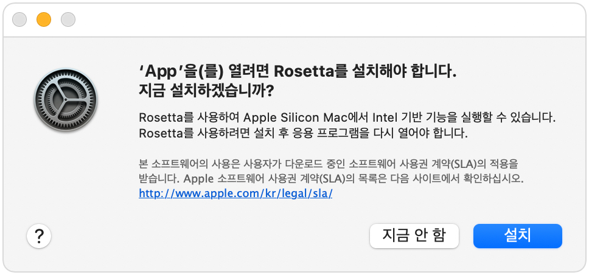
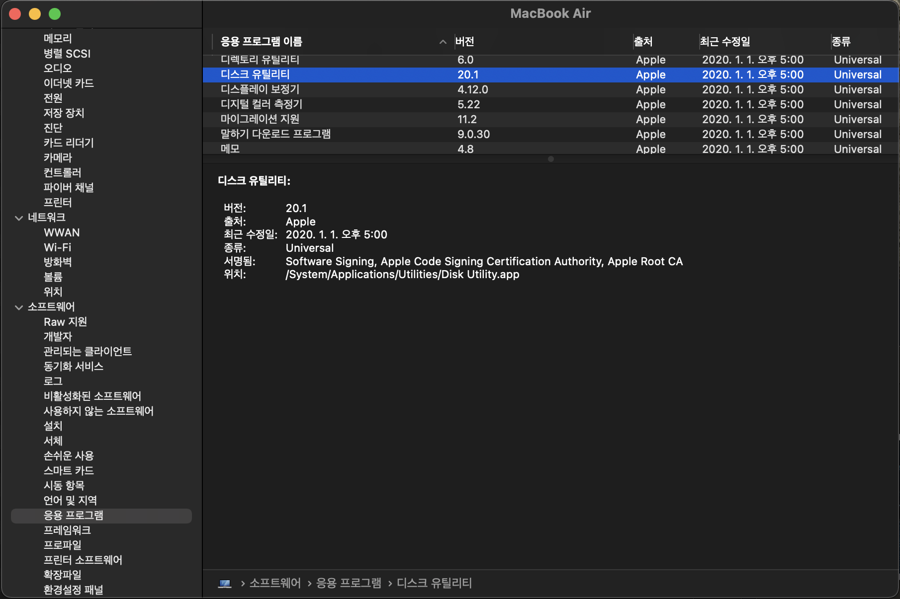

# 애플 실리콘용 / 인텔용 확인하는 방법

## M1 맥용 앱? 인텔 맥용 앱?
m1 맥북 출시후 벌써 반년이 되어가고 있는데, 그동안 국내외 많은 유튜버 등 인플루언서, IT 커뮤니티, 벤치마크 사이트 등을 통해 m1 맥의 뜨거운 관심과 놀라운 성능이 입증되었고, 최근 애플은 m1칩을 탑재한 새로운 iMac을 출시했습니다. m1 프로세서는 맥에 새로운 세상을 열었다고 해도 과언이 아닙니다.

## 인텔용 앱도 문제없어, 로제타!

m1 맥을 도입을 가장 망설이게 되는 부분이 바로 내 앱이 m1 맥을 지원하는 앱인가 하는 점일텐데요, **인텔 기반의 앱을 m1 맥에서도 실행할 수 있게 해주는 [로제타](https://support.apple.com/ko-kr/HT211861)**가 기대 이상으로 잘 동작하고, 링크된 문서에 작성되어 있는 것 처럼 로제타를 사용해서 실행한다고 하더라도 대부분의 경우 **앱 성능에서는 차이가 느껴지지 않기 때문에** 더더욱 이 걱정은 그저 기우일 뿐이라는 생각이 듭니다.

실제로 인텔용 앱을 사용하면 로제타 설치 메시지가 나오고, 설치 이후에는 자동으로 로제타를 이용해서 사용하는데, 인텔용 앱과 맥용 앱의 성능차이가 거의 없기 때문에 사용하는 도중에는 이 앱이 인텔용 앱인지, 맥용 앱인지 체감으로는 거의 불가능에 가깝고, 이 점은 애플에서 어느정도 의도한 부분도 있는 것 같습니다. 사용경험의 차이가 거의 없기 때문에 굳이 알필요도, 걱정할 필요도 없다는 것이죠.

## 굳이 알고싶다. 이게 정말 애플용 앱인가?!

사용 중간에 간간이 궁금해집니다. 자연스럽게 사용하고 있는 이 앱이 과연 애플용 앱인가? 이것을 확인하는 방법은 두 가지가 있습니다.

### *시스템 리포트 > 응용프로그램* 에서 확인하기
스크린 좌측 상단의 사과 아이콘  을 클릭하여 *이 Mac에 관하여*를 클릭합니다. 그럼 아래와 같은 창이 뜨는데 *시스템 리포트...*를 클릭합니다. 시스템 리포트 창이 뜨면 좌측에 *소프트웨어 > 응용 프로그램* 메뉴를 누르게되면 우측에 설치된 응용프로그램 목록이 나타납니다.

응용 프로그램을 선택하거나 목록의 우측의 종류를 통해 확인할 수 있습니다. 종류가 *Universal*로 표기된다면 m1맥 Intel맥에서 모두 실행되는 유니버설 앱이며, **Intel**로 표기된 앱은 인텚용 앱입니다.

### *활성 상태 보기* 를 이용하는 방법
*활성 상태 보기*를 이용하는 방법도 있습니다. *응용 프로그램 > 유틸리티*에서 *활성 상태 보기(Activity Monitor)*를 선택하거나, spotlight이나 Alfred를 이용해 실행시켜줍니다.

창을 보시면 현재 활성화되어있는 프로세스들을 확인할 수 있는데 해당 목록에 **아키텍쳐** 컬럼을 보시면 **Apple** 또는 **Intel**로 표기되어 있는 것을 확인할 수 있습니다. 해당하는 프로세스가 어떤 아키텍처에서 실행되고 있는지를 보여줍니다. 따라서 이 앱이 인텔용인지, 애플 실리콘 용 인지 확인할 수 있습니다.

이상 내가 쓰는 앱이 애플 실리콘 최적화 된 앱인지 인텔용 앱인지 확인하는 두 가지 방법을 알아보았습니다. 😁