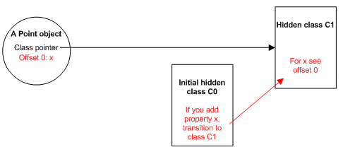

Hidden class와 inline caching은 사소해보일 수도 있지만 javascript의 최적의 성능을 위해서 알아두면 좋은 개념인 것 같다.

# Hidden class

javacript는 런타임에서 오브젝트의 속성을 추가/변경할 수 있는 동적인 언어이다. V8엔진은 **hidden class**를 통해 색인 등 속성 관리를 최적화하고 있다.

예를 들어 아래와 같은 코드가 있다고 할 때에

```jsx
function Point(x,y) {
	this.x = x;
	this.y = y;
}

var obj = new Point(1,2);
```

객체가 생성되는 시점에 객체에 대한 **hidden class**가 생성되며, 새로운 속성이 객체에 추가될 때마다 새로운 **hidden class**가 생성되며 **기존 hidden class에서 새로운 hidden class로의 전환**이 일어난다:





주의할 점은, 아래와 같은 코드가 있을 때:

```jsx
function Point(x,y) {
	this.x = x;
	this.y = y;
}

var obj1 = new Point(1,2);
var obj2 = new Point(3,4);

obj1.a = 5;
obj1.b = 10;

obj2.b = 10;
obj2.a = 5;1  function Point(x,y) {
	this.x = x;
	this.y = y;
}
 
var obj1 = new Point(1,2);
var obj2 = new Point(3,4);

obj1.a = 5;
obj1.b = 10;

obj2.b = 10;
obj2.a = 5;
```

처음 `obj1`와 `obj2`는 동일한 hidden class를 공유하지만, 속성을 추가하는 시점부터 hidden class가 달라진다고 한다:


# Inline Caching

동적 타입 최적화를 위해 **inline caching**을 사용하고 있다. 이 기법은 **동일한 메소드를 반복 호출할 때 동일한 유형의 객체에서 발생할 것이다**라는 점을 기반으로 하고 있다.

V8 엔진은 최근 호출된 메서드의 객체 타입을 캐싱해두고 있으면서 호출 속도를 높인다. 캐싱된 객체 타입이 일치한다면, 객체 속성에 직접 액세스하는 대신 캐싱되어있는 히든 클래스 정보를 사용하는 프로세스로 대신 수행할 수 있게 한다. 

만약 어떤 두 객체가 같은 hidden class를 공유한다면 실행속도가 크게 늘어날 수 있다. 또, hidden class의 변경이 없을 수록 캐싱의 효과가 좋다.

# 결론

Hidden class와 inline caching은  V8 엔진 기반 브라우저에서 최적의 퍼포먼스를 위해 알고 있으면 좋은 개념이다.

좋은 퍼모먼스를 위해 다음을 지키면 좋을 것 같다:

1. 가능한 hidden class의 변경을 줄일 것
2. 가능한 hidden class 공유가 잘 되도록 할 것

사실 typescript를 쓰거나 immutable한 코딩 습관을 가지고 있다면 자연스러운 일일 것 같다.

# Reference

[https://richardartoul.github.io/jekyll/update/2015/04/26/hidden-classes.html](https://richardartoul.github.io/jekyll/update/2015/04/26/hidden-classes.html)