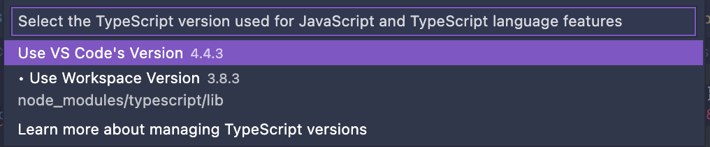

# `'hoist-non-react-statics/node_modules/@types/react'` auto import

여러 기기에서 같은 React 프로젝트 소스 작업을 하고 있었는데, 윈도우 PC에서는 auto import를 잘했는데 맥에서는 이상한 경로로 오토 임포트가 되어서 좀 황당한 일이 있었고 그에 대한 해결책을 공유한다.

vscode에서  `FC` 나 `useState` 등 리액트의 특정 기능들을 import  하려고 하면 `hoist-non-react-statics/node_modules/@types/react` 에서 auto import가 생겨나는 문제가 발생할 수 있다:

```jsx
import { FC } from 'hoist-non-react-statics/node_modules/@types/react';
import React from 'react';
```

이런식으로 완성되는데, 컴파일 에러가 발생한다. 다른 모듈 오토 임포트에서는 나타나지 않고, 리액트에서만 나타났다.

이럴 때에는 몇 가지 방법이 있다고 하는데, 나는 아래 방법을 통해 해결했다.

1. 커맨드 창을 연다 (shift+command+P 또는 shift+ctrl+p)
2. **TypeScript: Select TypesScript Version...** 커맨드를 찾아서 실행한다.
    
    
    
3. 선택된 Typescript 버전을 다른 것으로 바꿔본다.
내 경우에는 **Use Workspace Version** 으로 해결되었다.
    
    
    

# Reference

[Stackoverflow](https://stackoverflow.com/questions/69038328/why-is-vs-code-importing-from-hoist-non-react-statics-node-modules-types-react)