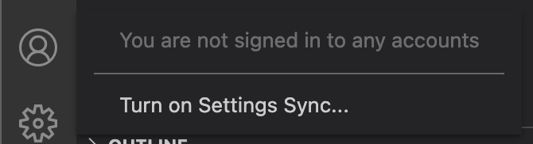

# vscode.dev(!) 공개 마참내!

[vscode.dev에 대한 포스트가  공개](https://code.visualstudio.com/blogs/2021/10/20/vscode-dev)되었다. vscode가 2019년 당시 `.dev` 도메인이 오픈될 때, `vscode.dev`   도메인을 구입했고, `[code.visualstudio.com](https://code.visualstudio.com/)` 로 가리키게 해두었는데, 드디어 `vscode.dev` URL에 걸맞는 Web IDE가 출시 되었다는 느낌이다. vscode의 [10여년간의 개발 역사를 공개한 키노트 영상](https://www.youtube.com/watch?v=hilznKQij7A&list=PLj6YeMhvp2S6uB23beQaffszlavLq3lNq)도 있다. 그간의 Web IDE들은 꽤 있었지만, [vscode가 1위 IDE인 만큼](https://visualstudiomagazine.com/articles/2021/01/13/wakatime-vs-code.aspx) 핫 이슈가 될 것 같다.

vscode는 대표적인 electron 프로젝트라고 볼 수 있는 타입스크립트 기반의 프로젝트다. 그래서 web으로도 당연히 쉽게 될 수 있지 않을까 했는데, 드디어 나오게 되었다. 웹버전으로의 출시가 타입스크립트 프로젝트 치고는 시간이 꽤 걸린 것으로 느껴지기도 한 것 같지만, 웹 환경의 성숙도가 이제야 그만큼 수준이 되었나 싶기도하고..

# vscode.dev로 개발? 클라우드 도구로 로컬 개발을.

vscode.dev는 [File System Access API](https://developer.mozilla.org/ko/docs/Web/API/File_System_Access_API)를 지원하는 모던 브라우저(크롬이나 엣지)의 기능을 이용해서 로컬  파일 편집을 지원하고 있는 것으로 보인다. vscode.dev로 설치 없이 로컬 개발을 할 수 있는 흥미로운 시나리오들을 소개하고 있다:

- 로컬 파일 색인 및 편집. 마크다운 작성 및 프리뷰. vscode를 설치할 수 없는 환경에서도 vs code를 열어서 로컬 파일을 작성할 수 있음 (와우..)
- 클라이언트 사이드의 HTML, Javascript, CSS 앱을 빌드하여 브라우저 툴로 디버깅 하기 (와.. 👏)
- vscde를 설치할 수 없는 저전력 머신 (e.g. 크롬북) 에서 코드를 편집하기
- iPad에서 개발하기(👏👏👏👏👏) 파일을 업로드, 다운로드 할 수 있고 (파일 앱을 이용해서 클라우드에 저장도할 수 있다!) 빌트인 되어있는 깃헙 리파지토리 확장으로 공개 리파지토리와 연결해 열 수도 있다.

만약 브라우저가 로컬 파일 시스템 API를 지원하지 않는다면 브라우저에서 파일을 업로드나 다운로드 해서 사용할 수 있게끔 되어있다고 한다.

정말 나날이 기술이 발전하면서 개발 환경이 좋아지고 있는 것 같다. 하지만 데스크탑 앱에 비해서 아직까지는 좀 더 **가벼운 수준의 경험**을 제공하고 있다고 하는데, 예를들어 터미널이나 디버거는 불가능하고, Rsut나 Go 애플리케이션을 브라우저샌드박스에서 컴파일, 실행, 디버깅 하는 것은 현재는 할 수 없다고 한다.

데스크탑에서 실행되는 것은 일반적으로 파일시스템에서 작동하는 컴파일러와 랭귀지 서비스에 의해 코드 수정, 네비게이션, 브라우징이 가능한 것이지만, vscode.dev는 브라우저에서 동작하는 랭귀지 서비스에서 제공되는 경험이라고 한다. 그래서 typescript, javascript, JSON, HTML, CSS, LESS 등 웹 관련 언어가 좋은 경험을 제공할 수 있을 것으로 보인다

# Setting Sync

또한 키바인딩, 확장 등을 포함한 환경설정도 [Setting Sync](https://code.visualstudio.com/docs/editor/settings-sync)를 통해서 가능하다고 한다.

vscode 좌측 하단에 사용자 아이콘 같은 동그란 아이콘을 클릭하면 Setting Sync를 설정할 수 있는 메뉴가 있다.

한글로는 **설정 동기화** 라는 것인데 Github이나 Microsoft 계정으로 설정할 수 있다.

그러면 vscode.dev를 들어가서 똑같은 위치에 있는 아이콘을 선택하면 **Turn on Setting Sync**를 선택하고 메뉴들을 선택하면, 깃헙으로 인증을 하게 되고, 기존 선택해둔 설정들을 다 가져올 수 있게된다.

테마나 기본적인 세팅들은 잘 동작하는 것 같았는데, `git checkout` 을 바로 하려고 한다든지 그런것은 어려운 것 같았고, gitlens 같은 일부 내가 좋아라 사용하고 있는 익스텐션은 되지 않아서 봤더니, vscode.dev에는 제공하지 안고 있었다 😢

그리고 한 가지 더 아쉬운 점은 bitbucket이나 gitlab같은 리파지토리 접근도 아직은 어려운 듯 하다. 뭔가 익스텐션이 생기면 달라지려나? 기대해본다.

하지만, 이정도 수준으로 가볍지만 내게 익숙한 개발 환경을 웹으로 (게다가 아이패드에서도!!) 즐길 수 있다는 것은 정말 큰 장점인 것 같다👏

그리고 이전까지는 [Setting Sync](https://marketplace.visualstudio.com/items?itemName=Shan.code-settings-sync)라는 익스텐션을 이용해서 환경설정 동기화를 해왔는데, 이게 Setting Sync 기능이 된 것일까? 무튼 이번 기회를 통해 Setting Sync 기능을 이용하게 되었는데 굉장히 만족스러운 것 같다. 

# vs Github Dev?

[github.dev](https://github.dev)라고 들어보셨을랑가 모르겠다. github도 github에 내장되어있는 Web IDE를 최근 출시했다. 깃헙 페이지에서 `.`을 누르게 되면 vscode가 뜨게 된다.  (아마도 github.dev가 [vscode.dev](http://vscode.dev) 예고편 같은 것 아니었을까?)

vscode와 거의 동일한 환경 (여기도 Setting Sync를 통해 기존 환경설정을 동기화 할 수 있다.)을 제공하고 있다. 그럼 [vscode.dev](http://vscode.dev) 는 뭐가 다른가? 비슷하지만 좀 다르다고 하는데,

- github.dev는 Github와 깊게 통합되어, 자동으로 로그인 되고 URL도 Github/organization/repo 형식으로 나타낸다고.
- vscode.dev는 Azure 리포도 지원한다고 한다.
- 또한 확장 테마도 URL을 통해서 공유 가능하다고 한다. 예를 들면, [https://vscode.dev/theme/sdras.night-owl](https://vscode.dev/theme/sdras.night-owl) 처럼.

# 결론

따끈따끈한 신상 Web 개발 환경인 vscode를 만나보았다 😎 브라우저에서 동작하는 것이기 때문에 몇 가지 한계로 인해 IDE라고 불러도 괜찮을지 모르겠다. 하지만 다른 시선으로 보면, 특히 웹 개발에 있어서는 많은 가능성을 가지고 있는 것 같다.

또, 공개 리포지토리 외에는 업로드 다운로드로 접근해야하는 것, 익스텐션의 웹vscode 미지원으로, 기존 데스크톱 앱 환경에서 사용하는 익스텐션을 사용할 수 없는 한계점도 있다. 하지만 이 부분들은 이제 막 시작했으니 차츰 좋아지지 않을까 생각한다.

무엇보다 설치 없이 어디서든 - 특히 크롬북이나 아이패드 같은 환경에서 - 나만의 개발 환경으로 가벼운 버전의 개발 경험을 느낄 수 있는게 큰 장점이라고 하겠다.

앞으로 Web IDE 환경이 얼마나 더 진화할 것인지 앞으로가 기대된다. 😆