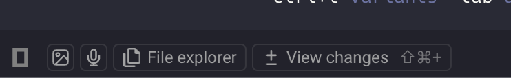

# warp, oh-my-opencode 짧게 사용해보고 느낀 후기

갑작스럽게 혜성처럼 나타나서 개발씬을 바꿔놓은 AI 코딩 에이전트.

지금도 엎치락뒤치락 자꾸만 쏟아지는 AI 모델들과 코딩 에이전트들 속에서 나는 무엇을 써야하는지 계속 고민 해야한다.

그 와중에서도 개발자들에게 인기가 있는 AI 모델과 코딩 에이전트들은 정해져 가고 있는 느낌이다.

사용자들의 요구사항을 빠르게 캐치하고 발빠르게 대응해서 불편을 해소하면서, 표준을 만들어나가고 시장을 선도해나가는 제품. 그런 제품들에 사람들이 열광하는 것 같다. (너무 과도하게 열광하고 몰리는 거 같기도..-_-;)

나는 사실 gemini cli 주 사용자이고, 매우 만족하고 쓰고 있다. 비록 주위에서는 제미나이? 시시해.. 이런 반응 이지만 ㅋㅋ
나는 제미나이 부터 gemini-cli까지 이러저러하게 만족하면서 쓰면서 결국 결제까지 했다 -_-ㅋ; 그래서 더더욱 다른 코딩 에이전트까지 돈 내고 사용하고 싶진 않은 편이고...

그런데 하도 주위에서..

- warp가 그렇게 좋다고...
- opencode가 그렇게 좋다고..
- opencode 쓰려면 oh-my-opencode가 유명하다고..

그래서 warp + opencode + oh-my-opencode 조합으로 한 번 써 봤다.

## warp의 장점

- 그래도 gemini-cli, opencode 등 코딩 에이전트와의 연계 지원을 한다.

- 기본적으로 markdown read 를 지원하나봄. 근데 아직 mermaid는 안되나봄 https://github.com/warpdotdev/warp/issues/7115

warp가 좀 불편한점

- 기존 vsocde는 file open은 cmd + p , action 은 shift + cmd + p 인데 warp는 file open 기본값은 cmd + o 임. 이런거 일일이 바꾸면서 쓰는거 별로 안좋아해서 그런지 불편으로 느껴짐 ㅠ
- 터미널과 프롬프트창이 좀 섞인 특별한 형태여서 그런지 ide가 아닌데도 ide를 쓰는것 같은 경험을 요구하게 될 때가 있다
  - git extension이 없어서 불편하다든지
  - code highlighting 에 vscode extension 단 수준으로 안보이니까 불편하다든지
- opencode 실행시 깨질때가 있다? (가끔 창에 이상한 문자들이 겹치는 현상들이 있었음)

## opencode + oh-my-opencode

- oh-my-opencode 유무 차이를 실감하긴 어려웠는데 (oh-my-opencode 거의 필수라고 해서 이미 설치하고 시작) opencode + oh-my-opencode 는 만족스러웠음.
- gemini-cli 보다 sub agent 실행이나 이런 것들이 자체 지원하는 것 같아서 좋았다
- 그리고 yolo 모드를 할 때 gemini-cli 보다 확실히 스피디하게 진행된다는 느낌이 있음.

전반적으로 만족해서 gemini-cli 보다 더 쓰지 않을까 생각이 들 정도였다.

## Superset

warp 쓰다가 나는 도저히 적응하지 못하고 결국 superset 이라는 것을 찾았다.
내가 원하는게 상당 부분 커버됐다.

- worksapce + worktree 지원
- worktree 브랜치가 하나의 탭이 된다.
- 브랜치별로 탭이 구분되어있어서 브랜치를 완벽히 병렬작업을 한다기보다 탭을 옮겨다니면서 작업해야한다. 하지만 같은 브랜치 내에서 터미널을 여러개 띄워서 작업하는것은 가능
- 멀티 윈도우를 아직까지는 지원하지 않고 있는 것 같다. 이부분이 제일 불편 ㅠㅠ
- 역시나 로그인이 필요한 점 (어떤 설정들이 세이브/로드 지원되는것인지..)
- change, file browse를 우측 pane에서 가능한게 좋다.
- 브랜치 넘나들면서 작업하기가 warp보다 훨씬 편함 (브랜치별로 다른 pane이나 윈도우로 쓰면 베스트이겠지만..ㅠ)
- markdown 뷰어도 제공!
- 하지만 파일을 직접 편집한다고 생각하면 살짝 불편한 감이 있다...

난 warp보다는 superset을 메인으로 사용해볼 예정.
