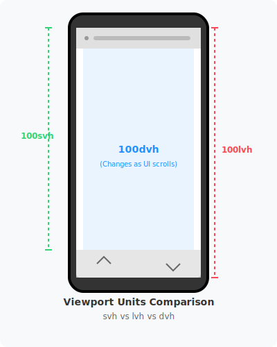
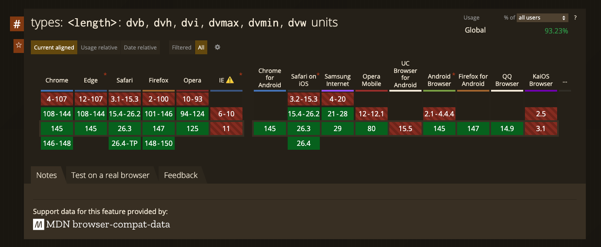

# [CSS] 모바일 환경을 위한 vh의 대안 사이즈 단위: dvw, lvw, svw, dvh, lvh, svh



## 📅 dvh의 탄생과 역사

1. **등장 시기**: 대략 2021년 말 ~ 2022년 초에 표준 제안이 활발해졌습니다.
2. **브라우저 지원 시작**:
    - **iOS Safari (v15.4)**: 2022년 3월부터 공식 지원을 시작했습니다. (아이폰 13/14/15/16 등의 환경은 모두 지원됩니다!)
    - **Chrome (v108)**: 2022년 11월부터 지원하기 시작했습니다.
    - **Firefox (v101)**: 2022년 5월부터 지원했습니다.

## 🔍 왜 이게 만들어졌을까요?

그전까지 개발자들은 `100vh`가 주소창 때문에 아래가 잘리는 문제를 해결하기 위해 '해킹'에 가까운 짓을 했습니다.

- **JS 사용**: `window.innerHeight`를 계산해서 `--vh`라는 CSS 변수에 수동으로 박아 넣었습니다. (성능이 떨어지고 리사이즈 시 화면이 덜덜 떨리는 문제가 있었습니다.)
- **webkit-fill-available**: 사파리 전용 속성을 썼지만, 크롬이나 다른 브라우저에서 레이아웃이 깨지는 부작용이 있었습니다.

이런 고통을 끝내기 위해 브라우저들이 "우리가 주소창 변화를 감지해서 새로운 뷰포트 단위를 제공하자!"라고 합의해서 만든 것이 바로 `svh`, `lvh`, `dvh`입니다.

## 💡 dvh의 삼형제

- **`svh` (Small Viewport Height)**: 주소창이 가장 크게 떠 있을 때의 최소 가용 높이.
- **`lvh` (Large Viewport Height)**: 주소창이 사라졌을 때의 최대 가용 높이.
- **`dvh` (Dynamic Viewport Height)**: 실시간으로 변하는 가용 높이. (우리가 쓴 것!)

dvh는 결코 iOS 전용 기술이 아닙니다! 모든 주요 브라우저(Chrome, Safari, Firefox 등)가 합의한 '글로벌 웹 표준'입니다. 안드로이드 사용자들도 똑같이 이 혜택을 누릴 수 있습니다. 😊

## 🌐 브라우저별 dvh 지원 시작 버전 (지원 일람)



| 브라우저 / OS | 지원 시작 버전 | 출시 시기 | 비고 |
| :--- | :--- | :--- | :--- |
| **iOS Safari** | 15.4+ | 2022년 3월 | 아이폰 12~16 등 대부분의 현역 기기 |
| **Android Chrome** | 108+ | 2022년 11월 | 안드로이드 12/13 이후 대부분의 기기 |
| **Samsung Internet** | 21.0+ | 2023년 중순 | 갤럭시 사용자들의 기본 브라우저 |
| **Desktop Chrome** | 108+ | 2022년 11월 | 데스크탑에서도 표준으로 작동함 |
| **Firefox** | 101+ | 2022년 5월 | - |

---

## 💡 왜 iOS에서 유독 강조될까요? (중요한 이유)

안드로이드보다 iOS 사파리/웹뷰의 주소창(Toolbar) 동작 방식이 훨씬 더 공격적이고 변칙적이기 때문입니다.

- **iOS**: `100vh`를 주소창 뒤쪽까지 포함하는 '고정값'으로 정의해서 개발자들을 오랫동안 괴롭혔습니다. (그래서 dvh가 아이폰 사용자들에게는 '가뭄의 단비' 같은 기술이었습니다.)
- **Android**: 기종마다 툴바 동작이 다르지만, 사파리만큼 `100vh`가 문제를 일으키는 빈도가 낮았습니다. 하지만 지금은 안드로이드에서도 dvh를 쓰는 것이 '가장 안전하고 표준적인 방식'으로 자리 잡았습니다.

---

## 🛡️ 구형 버전(iOS 15.4 미만)에서는 어떻게 되나요?

우리가 작성한 '방어 코드(Fallback Strategy)'가 빛을 발하는 지점입니다.

```css
/* LayoutFrame.tsx 내부 로직 */
height: 100%;    /* (1) 구형 기기를 위한 백업 */
height: 100dvh;  /* (2) 최신 기기를 위한 정밀 조절 */
```

- **구형 기기**: `100dvh`를 이해하지 못해 무시하고, 바로 앞의 `height: 100%`를 따릅니다. (어느 정도 레이아웃이 방어됩니다.)
- **최신 기기**: `100dvh`를 인식하여 `height: 100%`보다 우선적으로 적용합니다. (가장 완벽한 높이를 찾아냅니다.)

결론적으로, dvh는 전 세계의 모든 현대적인 스마트폰 사용자들을 위한 '가장 세련된 높이 조절 기술'이라고 보시면 됩니다!

## 🔍 -webkit-fill-available vs dvh (비교 분석)

### 1. webkit-fill-available (채우기 방식 - "그릇에 맞춰라")
- **성격**: 브라우저 고유의 '비표준 확장'입니다. (주로 사파리/웹뷰 전용)
- **동작**: "이 요소가 들어갈 수 있는 모든 가능한 공간(Available Space)을 꽉 채워라!"라고 명령합니다.
- **특징**:
    - **자동 조절**: 브라우저 툴바가 나오거나 사라질 때, 브라우저 엔진이 판단한 '남은 공간'을 알아서 채워줍니다.
    - **의존성**: 부모 요소의 높이 계산 방식에 영향을 많이 받습니다.
    - **단점**: '비표준'이라 크롬이나 파이어폭스 등 다른 브라우저에서는 레이아웃이 깨지거나 무시되는 경우가 많아, 항상 브라우저별 분기 처리가 필요합니다.

### 2. dvh (측정 방식 - "화면을 재라")
- **성격**: 전 세계 모든 브라우저가 합의한 '공식 표준 단위'입니다.
- **동작**: "지금 화면(Viewport)의 실제 높이가 몇 픽셀인지 재서, 그 값만큼 크기를 정해라!"라고 명령합니다.
- **특징**:
    - **예측 가능성**: 단순히 채우는 게 아니라 '수치'를 기반으로 하므로, `calc(100dvh - 50px)`처럼 정밀한 계산이 가능합니다. (fill-available은 이런 계산이 어렵습니다.)
    - **호환성**: 현대적인 모든 브라우저에서 동일한 로직으로 작동합니다.

## Reference

- [MDN: Relative length units based on viewport](https://developer.mozilla.org/ko/docs/Web/CSS/Reference/Values/length#relative_length_units_based_on_viewport)
- [Can I use: dvh](https://caniuse.com/?search=dvh)
- [모바일에서 100vh가 원하는대로 작동하지 않는다면 (feat. dvh, svh, lvh)](https://dev-102.tistory.com/entry/%EB%AA%A8%EB%B0%94%EC%9D%BC%EC%97%90%EC%84%9C-100vh%EA%B0%80-%EC%9B%90%ED%95%98%EB%8A%94%EB%8C%80%EB%A1%9C-%EC%9E%91%EB%8F%99%ED%95%98%EC%A7%80-%EC%95%8A%EB%8A%94%EB%8B%A4%EB%A9%B4-feat-dvh-svh-lvh)

