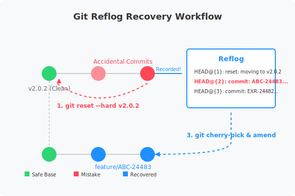

# [Git] 실수로 master에 머지했을 때, 당황하지 않고 reflog로 심폐소생하기



개발을 하다 보면 누구나 한 번쯤 "아차" 하는 순간이 있습니다. 가장 흔하면서도 아찔한 순간 중 하나는 **작업 브랜치가 아닌 `master` 브랜치에 직접 커밋을 쌓거나 머지해버린 상황**일 것입니다.

특히 원격 저장소(`origin/master`)에 이미 푸시까지 해버렸다면 식은땀이 흐르기 마련입니다. 하지만 걱정 마세요. Git은 우리 생각보다 훨씬 치밀하게 우리의 발자취를 기록하고 있습니다. 오늘은 이런 상황을 어떻게 우아하게 해결했는지, 그리고 그 중심에 있는 `reflog`에 대해 이야기해보려 합니다.

---

## 1. 상황 발생: "내 커밋이 왜 master에 있지?"

분명 피처 브랜치를 따서 작업했다고 생각했는데, 정신을 차려보니 `master` 브랜치에 4개의 커밋이 직접 올라가 있고 원격 저장소까지 푸시된 상태였습니다. 

팀의 컨벤션상 모든 작업은 Jira 티켓 번호(예: `EXR-24483`)를 포함한 커밋 메시지와 함께 전용 피처 브랜치에서 Pull Request를 통해 머지되어야 합니다. 지금의 `master`는 오염된 상태가 된 것이죠.

## 2. 해결 전략: Reset, Rescue, Reconstruct

당황해서 `git pull`을 받거나 무작정 새 커밋을 올리면 상황은 더 꼬입니다. 저는 다음과 같은 단계로 침착하게 대응했습니다.

### Step 1: 오염된 master 정화하기 (Reset & Force Push)
먼저 로컬의 `master` 브랜치를 문제가 없던 마지막 깨끗한 상태(여기서는 `v2.0.2` 태그 시점)로 강제로 돌려놓습니다.

```bash
git checkout master
git reset --hard v2.0.2
git push -f origin master
```
*주의: 강제 푸시(`-f`)는 팀원들과 공유하는 브랜치에서 매우 조심해야 하지만, 방금 막 발생한 실수를 바로잡는 골든타임에는 가장 확실한 방법입니다.*

### Step 2: 사라진 커밋 구출하기 (The Power of Reflog)
`reset --hard`를 실행하는 순간, 우리가 열심히 작성했던 4개의 커밋은 눈앞에서 사라집니다. 하지만 Git은 이를 완전히 지우지 않습니다. 이때 사용하는 마법 같은 명령어가 바로 `reflog`입니다.

```bash
git reflog
```
이 명령어를 입력하면 HEAD가 이동했던 모든 기록이 나옵니다. `reset` 하기 직전의 커밋 해시값들을 여기서 다시 찾아낼 수 있습니다. "사라진 줄 알았던 내 코드의 족보"를 확인하는 순간이죠.

### Step 3: 새 브랜치에서 역사 재구성하기 (Cherry-pick & Amend)
이제 올바른 이름의 피처 브랜치를 만들고, `reflog`에서 찾은 커밋들을 하나씩 가져오면서 컨벤션에 맞게 메시지를 수정합니다.

```bash
git checkout -b feature/EXR-24483
git cherry-pick <사라졌던_커밋_해시_1>
git commit --amend -m "feat: EXR-24483 작업 내용 요약"
# ... 반복
```
이렇게 하면 `master`는 깨끗하게 원복되고, 내 작업물은 올바른 브랜치에서 올바른 메시지를 가진 채 부활하게 됩니다.

---

## 3. 핵심 개념: Git Reflog란 무엇인가?

우리가 흔히 쓰는 `git log`는 **브랜치의 커밋 히스토리**를 보여줍니다. 즉, 커밋을 삭제하거나 브랜치를 옮기면 로그도 변합니다.

반면 `git reflog`는 **로컬 저장소에서 HEAD가 가리켰던 모든 위치의 기록**입니다. 
- 커밋을 취소했을 때 (`reset`)
- 브랜치를 이동했을 때 (`checkout`)
- 커밋 메시지를 고쳤을 때 (`amend`)
- 심지어 리베이스를 하다가 꼬였을 때도

Git은 내부적으로 약 30~90일 동안 이 기록을 보관합니다. 따라서 "커밋을 했는데 사라졌다"면 십중팔구 `reflog`에서 찾을 수 있습니다. **Git 세계의 블랙박스이자 최후의 보루**인 셈입니다.

---

## 4. 마치며: 실수는 성장의 자양분

실수는 누구나 합니다. 중요한 것은 그 실수를 어떻게 수습하느냐, 그리고 그 과정에서 도구의 원리를 얼마나 깊이 이해하느냐입니다. 

이번 사고(?) 덕분에 저는 `reflog`의 든든함을 다시 확인했고, 팀원들에게는 더 깔끔한 커밋 히스토리를 제공할 수 있었습니다. 혹시 지금 `master` 브랜치에 잘못 머지하고 손을 떨고 계신 분이 있다면, 잠시 숨을 고르고 `git reflog`를 입력해보세요. 길은 그곳에 있습니다.
